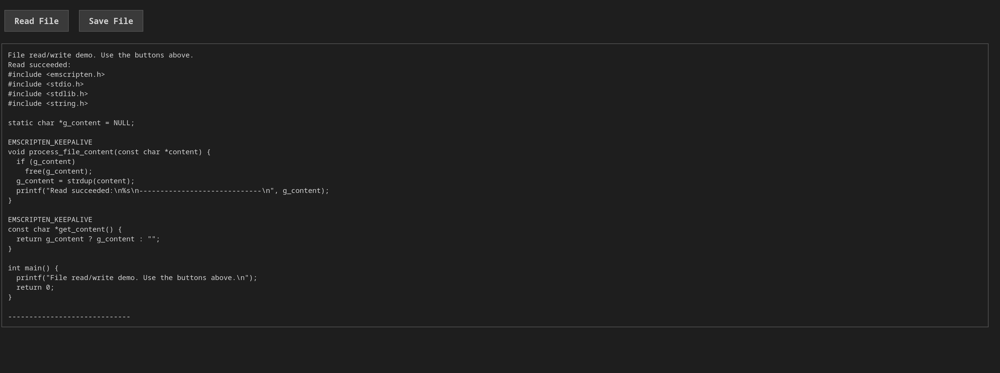
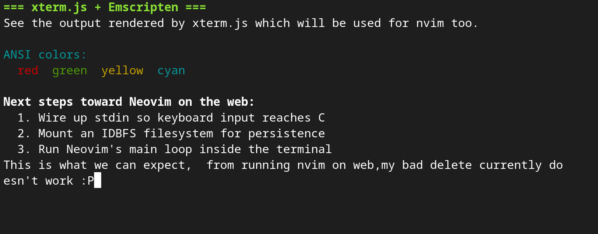

# emscripten_trail

This is a repo I used to mess around and learn about Emscripten which I believe
will be a great choice to put neovim on the web.

Each part of the learning will be in its own folder, which should contain a C
file, the compiled html code, the compiled glue js code, and the compiled
binary code.

## Lessons

1. Hello Neovim, a simple program, but runs C in web.
2. fileOperation, a simple (which we will not be using for neovim) way to do file read/write using C in web.

3. xterm rendering, a simple demo on how xterm may looks like, which is what I believe will be used to emulate neovim later.
/
